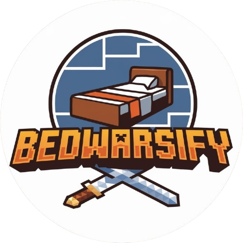

# Bedwarsify
### Minecraft Bedwars Strategy Guide

**Welcome to Bedwarsify**, a web application designed to help Minecraft Bedwars players improve their skills and dominate the game! Whether you're a beginner looking to learn the basics or an advanced player aiming to master pro strategies, Bedwarsify provides expert tips, video tutorials, and interactive resources to elevate your gameplay.

<div align="center">




#### Website: [Visit Bedwarsify](https://bedwarsify.vercel.app)

</div>

---

## 🚀 Project Overview

Bedwarsify is a Flask-based web application that serves as a comprehensive strategy guide for Minecraft Bedwars players. The site offers a clean, responsive design with light/dark theme support, user authentication, and a variety of resources to help players of all skill levels succeed in Bedwars.

### Key Features
- **Winning Strategies:** Explore strategies for beginner, intermediate, and advanced players, complete with detailed descriptions and visuals.
- **Video Tutorials:** Watch curated YouTube tutorials to learn from the best Bedwars players.
- **Interactive Maps:** Visualize key locations and plan your strategies with interactive Bedwars maps.
- **User Authentication:** Sign up, log in, and log out securely to access personalized features.
- **Contact Form:** Reach out to the Bedwarsify team with questions or feedback.
- **About Page:** Learn about the mission and team behind Bedwarsify.
- **Responsive Design:** Enjoy a seamless experience on both desktop and mobile devices.
- **Light/Dark Theme:** Toggle between light and dark modes for a comfortable viewing experience.

---

## 🛠️ Installation

Follow these steps to set up Bedwarsify locally on your machine.

### Prerequisites
- **Python 3.6+**: Ensure Python is installed on your system. [Download Python](https://www.python.org/downloads/)
- **pip**: Python package manager (comes with Python).
- **Git**: To clone the repository. [Download Git](https://git-scm.com/downloads)

### Steps
1. **Clone the Repository**
   ```bash
   git clone https://github.com/SamXop123/Bedwarsify.git
   cd bedwarsify
   ```

2. **Set Up a Virtual Environment** (Recommended)
   ```bash
   python -m venv venv
   source venv/bin/activate  # On Windows: venv\Scripts\activate
   ```

3. **Install Dependencies**
   ```bash
   pip install -r requirements.txt
   ```

   If there’s no `requirements.txt` file yet, install Flask manually:
   ```bash
   pip install flask
   ```

4. **Run the Application**
   ```bash
   python app.py
   ```

5. **Access the Website**
   Open your browser and navigate to:
   ```
   http://127.0.0.1:5000
   ```

---

## 📖 Usage

Once the application is running, you can explore the following features:

- **Homepage (`/`)**: Start your journey with an overview of strategies, video tutorials, interactive maps, and a call to join the community.
- **Winning Strategies (`#learn-strategy`)**: Browse strategies for different skill levels (Beginner, Intermediate, Advanced).
- **Video Tutorials (`#video-guides`)**: Watch embedded YouTube tutorials to improve your gameplay.
- **Interactive Maps (`#interactive-maps`)**: Explore a featured Bedwars map with strategic insights.
- **Sign Up (`/signup`)**: Create an account to access personalized features.
- **Log In (`/login`)**: Log in to your account.
- **Log Out (`/logout`)**: Log out securely.
- **Contact (`/contact`)**: Send a message to the Bedwarsify team.
- **About (`/about`)**: Learn about the mission and team behind Bedwarsify.

### Example Screenshots
| Homepage | Strategies Section |
|----------|--------------------|
|  |  |


---

## 📂 File Structure

Here’s an overview of the project’s file structure:

```
bedwarsify/
│
├── static/
│   ├── css/
│   │   └── styles.css        # Main stylesheet for the website
│   ├── js/
│   │   ├── darkmode.js      # For theme toggle
│   │   └── scripts.js       # JavaScript 
│   │
│   └── images/              # Images used in the website
│
├── templates/
│   ├── base.html            # Base template layout
│   ├── index.html           # Homepage template
│   ├── guide.html           # Guide page template
│   ├── login.html           # Login page template
│   ├── signup.html          # Sign-up page template
│   ├── contact.html         # Contact page template
│   └── about.html           # About page template
│
├── app.py                   # Main Flask application
├── requirements.txt         # Python dependencies
└── README.md                # Project documentation
```

---

## 🧰 Technologies Used

- **Flask**: A lightweight Python web framework for building the backend.
- **HTML/CSS/JavaScript**: Frontend technologies for creating a responsive and interactive UI.
- **Jinja2**: Templating engine for rendering dynamic HTML content.
- **Lucide Icons**: Icon library for adding beautiful icons to the site.
- **Bootstrap (Optional)**: If you’ve included Bootstrap for styling (not explicitly used in the current code).
- **Python**: Core programming language for the backend logic.

---

## 🌟 Contributing

We welcome contributions to make Bedwarsify even better! If you’d like to contribute, please follow these steps:

1. **Fork the Repository**
   Click the "Fork" button at the top of this page to create a copy of the repository under your GitHub account.

2. **Clone Your Fork**
   ```bash
   git clone https://github.com/samxop123/Bedwarsify.git
   cd Bedwarsify
   ```

3. **Create a Branch**
   ```bash
   git checkout -b feature/your-feature-name
   ```

4. **Make Changes**
   Implement your feature or bug fix, and ensure the code follows the project’s style guidelines.

5. **Commit Your Changes**
   ```bash
   git add .
   git commit -m "Add your feature description"
   ```

6. **Push to Your Fork**
   ```bash
   git push origin feature/your-feature-name
   ```

7. **Create a Pull Request**
   Go to the original repository on GitHub and create a pull request from your branch. Provide a detailed description of your changes.

---

## 📜 License

This project is licensed under the MIT License. See the [LICENSE](LICENSE) file for details.

---

## 📧 Contact

Have questions or feedback? Reach out to the Bedwarsify team!

- **Email**: sameerprajapati066@gmail.com
- **Website**: [Visit Bedwarsify](https://bedwarsify.vercel.app)
